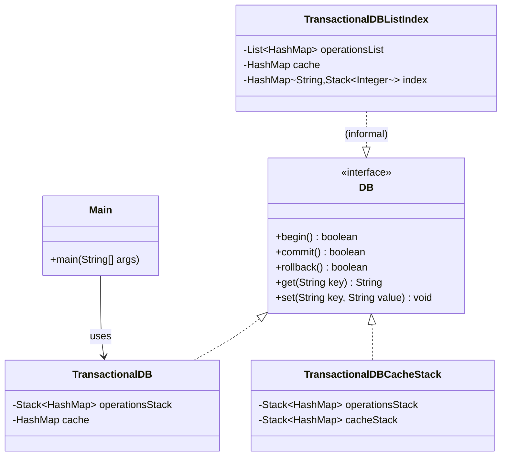
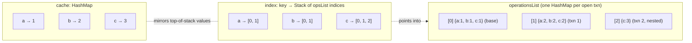
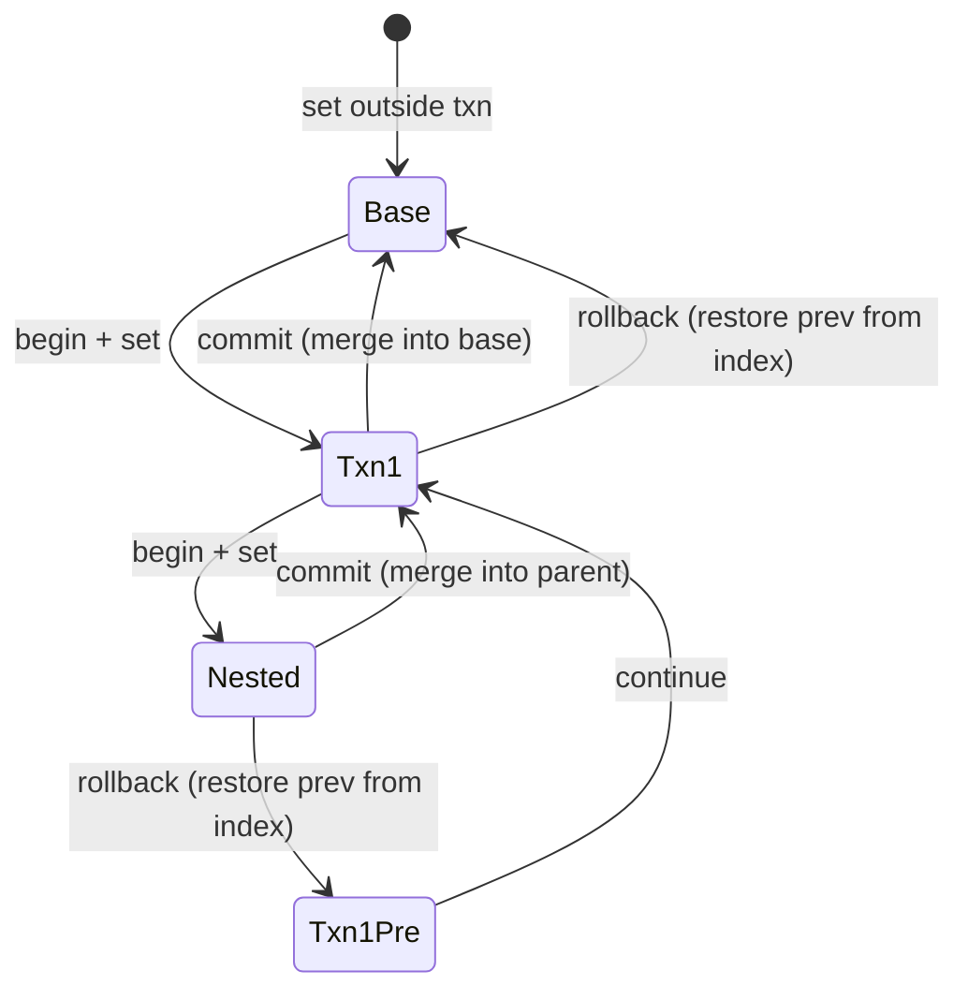

# In-Memory Transaction DB — Architecture

An in-memory key/value store supporting nested transactions (`begin` / `commit` / `rollback`).
Three implementations explore different trade-offs around the same `DB` interface.

## Class structure



## Data layout — `TransactionalDBListIndex` (latest implementation)



## Operation flow

```mermaid
sequenceDiagram
    actor Caller
    participant DB as TransactionalDBListIndex
    participant Cache as cache
    participant Ops as operationsList
    participant Idx as index

    Caller->>DB: set(k, v)
    DB->>Cache: put(k, v)
    DB->>Idx: ensure stack(k); push(size-1)
    DB->>Ops: last().put(k, v)

    Caller->>DB: get(k)
    DB->>Cache: get(k)
    Cache-->>Caller: value

    Caller->>DB: begin()
    DB->>Ops: add(new HashMap)

    Caller->>DB: commit()
    note over DB: merge top frame into parent frame,<br/>pop one entry from each touched index stack
    DB->>Ops: pop last, write entries into new last
    DB->>Idx: pop top for each key in popped frame

    Caller->>DB: rollback()
    note over DB: discard top frame; restore cache from<br/>previous value via index lookup
    DB->>Idx: pop top for each key in top frame
    DB->>Cache: restore from operationsList[index.peek()] or remove
    DB->>Ops: remove last
```

## State machine — a single key across nested transactions


